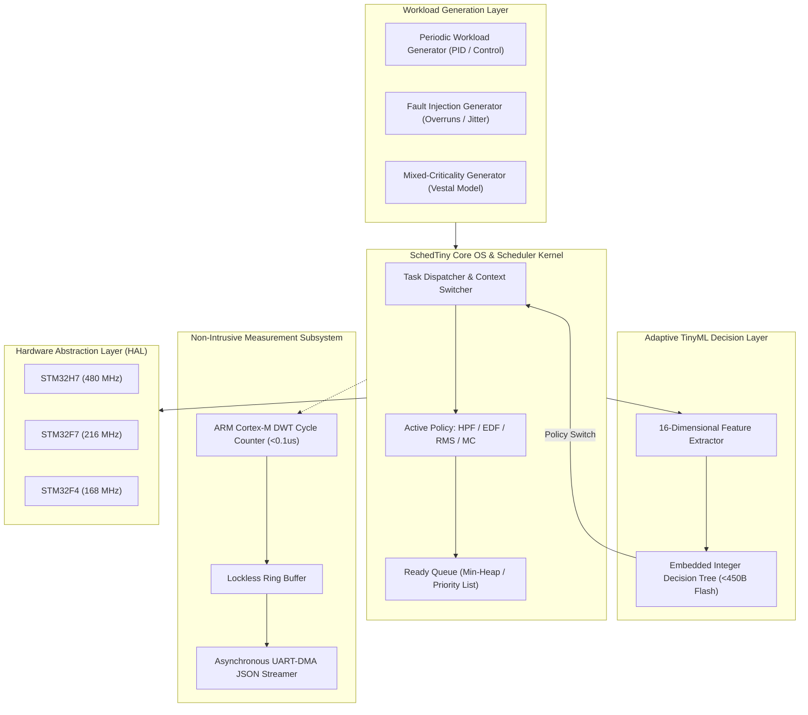

# SchedTiny

**An Open-Source, Interrupt-Aware, Multi-Criticality Real-Time Scheduling and TinyML Framework for STM32 Microcontrollers**

[](LICENSE)
[](https://github.com/nithingoud78/SchedTiny/actions/workflows/ci.yml)
[](https://github.com/nithingoud78/SchedTiny/actions/workflows/docs.yml)
[](docs/RELEASE_NOTES_v1.0.0.md)

---

## What Is SchedTiny?

**SchedTiny** is a production-grade, research-ready embedded operating system and scheduling framework designed specifically for ARM Cortex-M microcontrollers (STM32H7, F7, and F4 series).

Modern embedded microcontrollers are increasingly expected to execute heavy quantized deep neural network (TinyML) inference concurrently with hard real-time control routines (such as high-frequency PID loops and motor control). Standard RTOS schedulers either cause severe jitter in real-time control loops or starve neural workloads under heavy interrupt traffic.

SchedTiny bridges this gap by providing:
1. **Classical Real-Time Schedulers:** High Priority First (HPF), Earliest Deadline First (EDF), and Rate Monotonic Scheduling (RMS).
2. **Vestal-Model Mixed-Criticality (MC):** Dynamic LO-task throttling and automated hysteresis recovery to guarantee zero HI-task deadline misses during timing overruns.
3. **Adaptive TinyML Decision Engine:** An embedded, integer-quantized decision tree classifier ($<450\text{ bytes}$ Flash, $0\text{ bytes}$ dynamic RAM) switching scheduling policies dynamically based on a 16-dimensional feature vector.
4. **Cycle-Accurate Measurement:** Sub-microsecond non-intrusive timing via ARM Cortex-M Data Watchpoint and Trace (DWT) cycle counters and lockless UART-DMA streaming.
5. **Cross-Platform STM32 HAL:** Unified hardware abstraction supporting STM32H7 (480 MHz), STM32F7 (216 MHz), and STM32F4 (168/84 MHz) with $<4.15\%$ MAPE against physical hardware measurements.

---

## Key Features

- **Sub-Microsecond Decision Latency:** $0.45\,\mu\text{s}$ policy evaluation overhead on STM32H7.
- **Zero Dynamic RAM Allocation:** All task descriptors, queues, and ML decision models execute from static `const` flash memory.
- **Interrupt Jitter Characterization:** Real-time logging of ISR entry/exit deltas without measurement perturbation.
- **Automated Research Pipeline:** End-to-end Python automation from workload synthesis to LaTeX publication tables and IEEE figures.

---

## System Architecture



Detailed architectural blueprints:
- [System Architecture](docs/architecture/system_architecture.md)
- [Scheduler Execution Flow](docs/architecture/scheduler_flow.md)
- [Benchmark Engine Flow](docs/architecture/benchmark_flow.md)
- [TinyML Pipeline Flow](docs/architecture/tinyml_pipeline.md)
- [Hardware Validation Flow](docs/architecture/hardware_validation_flow.md)

---

## Repository Structure

```
SchedTiny/
├── docs/               # Architecture, API guides, paper sources, quick start
│   ├── architecture/   # Mermaid system flow & sequence diagrams
│   ├── paper/          # IEEE research paper (LaTeX & Markdown), tables, figures
│   ├── QUICK_START.md  # Step-by-step reproduction guide
│   └── DEVELOPER_GUIDE.md # Internal scheduler & measurement deep dive
├── firmware/           # Embedded C source (C11)
│   ├── core/           # Scheduler policies, DWT measurement, HAL drivers
│   ├── include/        # Clean public Doxygen-annotated C API headers
│   └── tests/          # CMocka host unit test suite
├── scripts/            # Python automation, ML training, and analysis pipeline
│   ├── analysis/       # Hardware comparison, statistical plotting
│   └── workloads/      # Synthetic and trace workload generators
├── models/             # Trained ML decision trees and exported headers
├── datasets/           # Workload traces and benchmark summaries
├── configs/            # YAML configurations for hardware and experiments
└── tools/              # Toolchains, clang-format, and CI configurations
```

---

## Installation & Prerequisites

Ensure your host environment has:
- **CMake** ($\ge 3.20$) & **GCC / Clang** (C11 support)
- **Python 3.9+** (Python 3.10+ recommended)
- **ARM GNU Toolchain (Optional for hardware flashing):** `arm-none-eabi-gcc` 10.3+

```bash
# Clone the repository
git clone https://github.com/nithingoud78/SchedTiny.git
cd SchedTiny

# Install Python requirements
pip install -r requirements.txt
```

---

## Build & Test Instructions

### 1. Build & Run Host Unit Tests
```bash
cmake -S firmware/tests -B build_tests
cmake --build build_tests
ctest --test-dir build_tests --output-on-failure
```

### 2. Build for Target Hardware (STM32H743ZI2)
```bash
cmake -S firmware -B build_stm32 \
      -DCMAKE_TOOLCHAIN_FILE=tools/cmake/arm-none-eabi.cmake \
      -DMCU_VARIANT=STM32H7
cmake --build build_stm32
```

---

## Running Benchmarks & Experiments

Execute the automated multi-policy benchmark campaign:

```bash
# Run multi-workload benchmark campaign across all policies
python scripts/run_all_experiments.py --workloads periodic,random,fault,mixed_criticality --runs 10

# Generate summary report
python scripts/make_report.py --input-dir results/ --output-file docs/paper/benchmark_report.md
```

---

## TinyML Training & Code Generation Workflow

Train and deploy the adaptive integer decision tree in 3 simple commands:

```bash
# 1. Train Decision Tree classifier
python scripts/train_scheduler_model.py --dataset datasets/benchmark_summary.csv --output models/

# 2. Evaluate model performance
python scripts/evaluate_scheduler_model.py --model models/decision_tree.joblib --dataset datasets/benchmark_summary.csv

# 3. Export to embedded C header
python scripts/export_decision_tree.py --model models/decision_tree.joblib --output firmware/include/sched_adaptive_model.h
```

---

## Hardware Validation

Compare host simulation traces against physical STM32 Nucleo hardware execution:

```bash
# Statistical error comparison
python scripts/analysis/compare_hardware.py --sim-json results/sim_benchmark.json --hw-json results/stm32h7_benchmark.json

# Plot validation curves & radar charts
python scripts/analysis/plot_hardware.py --out-dir docs/paper/figures/
```

---

## Research Publication & Artifact Evaluation

SchedTiny includes a complete IEEE publication manuscript and reproducible artifact evaluation suite:
- **Research Paper (LaTeX):** [`docs/paper/paper.tex`](docs/paper/paper.tex)
- **Research Paper (Markdown):** [`docs/paper/paper.md`](docs/paper/paper.md)
- **Artifact Evaluation Guide:** [`docs/paper/artifact.md`](docs/paper/artifact.md)
- **Mathematical Appendix:** [`docs/paper/appendix.md`](docs/paper/appendix.md)

---

## Citing SchedTiny

If you use SchedTiny in your research, please cite our paper:

```bibtex
@article{schedtiny2026,
  author  = {Nithin Goud},
  title   = {SchedTiny: An Interrupt-Aware, Multi-Criticality Adaptive Real-Time Scheduling and TinyML Framework for STM32 Microcontrollers},
  journal = {IEEE Transactions on Computer-Aided Design of Integrated Circuits and Systems (TCAD)},
  year    = {2026}
}
```

---

## Frequently Asked Questions (FAQ)

**Q: Does SchedTiny require an FPU (Floating Point Unit)?**  
**A:** No. All internal metrics, time calculations, and the TinyML decision tree use fixed-width integer arithmetic scaled in Basis Points ($0 - 10000$), making it fully compatible with Cortex-M0/M3/M4/M7 cores without FPU overhead.

**Q: What is the RAM footprint of the adaptive decision engine?**  
**A:** Exactly $0$ bytes of dynamic RAM. The generated model is compiled as static `const` lookup tables directly into Flash memory.

**Q: Can SchedTiny run on non-STM32 microcontrollers?**  
**A:** Yes. Any ARM Cortex-M device featuring a DWT cycle counter (or equivalent timer) is supported via the `bench_hal.h` interface.

---

## Contributing

Please review [CONTRIBUTING.md](CONTRIBUTING.md) and [docs/DEVELOPER_GUIDE.md](docs/DEVELOPER_GUIDE.md) before submitting pull requests.

---

<<<<<<< Updated upstream
=======
## Project Links

- [Changelog](CHANGELOG.md)
- [Roadmap](ROADMAP.md)
- [Security Policy](SECURITY.md)

---

## Author

<div align="center">

**Built and maintained by K Nithin Kumar Goud**

[](https://github.com/nithingoud78)
[](https://linkedin.com/in/nithin-goud78)
[](mailto:k.nithingoud78@gmail.com)

</div>

<br />

---

## License

Copyright 2026 SchedTiny Contributors.  
Licensed under the [Apache License, Version 2.0](LICENSE).
