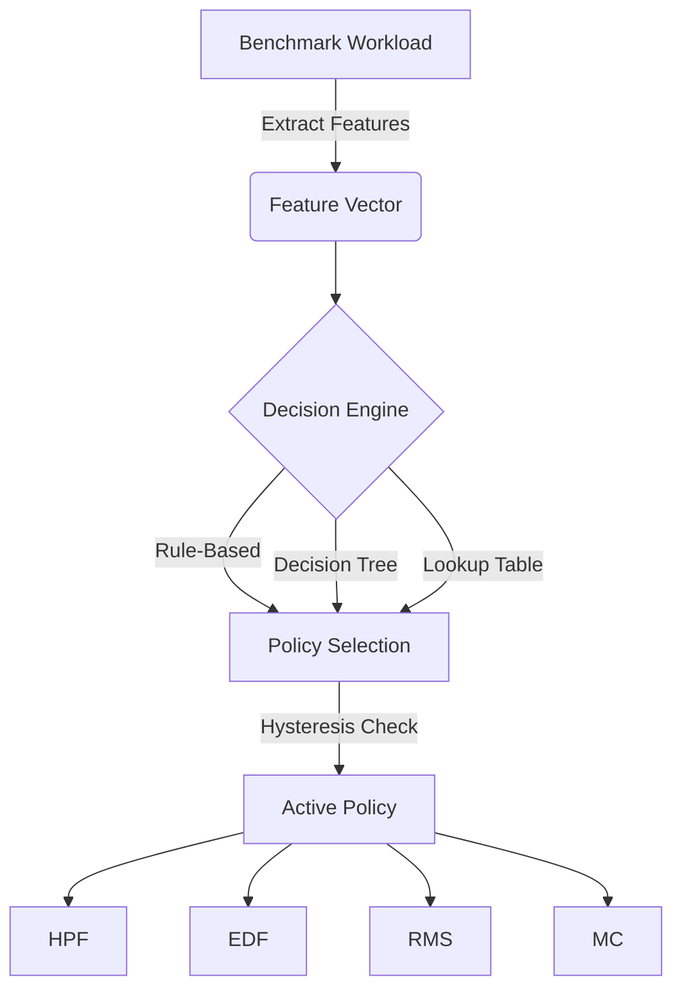

# SchedTiny Adaptive Scheduler

The Adaptive Scheduler is an AI-assisted framework that dynamically selects the optimal scheduling policy (HPF, EDF, RMS, or Mixed Criticality) at runtime based on current workload characteristics. It is designed for resource-constrained embedded systems and relies entirely on static memory, integer arithmetic, and deterministic execution.

## Architecture

The adaptive scheduler sits above the underlying scheduling policies and acts as an orchestrator. It extracts runtime features from the benchmark state and passes them through a decision engine to select the best policy.

## Feature Vector

The adaptive scheduler extracts 16 features from the workload. All features are normalised to a basis point (bp) scale (0–10000) to allow integer-only inference.

- **CPU Utilization (bp)**
- **Task Count**
- **Ready Queue Length**
- **Average Response Time**
- **Average Waiting Time**
- **Deadline Miss Rate (bp)**
- **Context Switch Rate (bp)**
- **Idle Time**
- **Busy Time**
- **Fault Injection Rate (bp)**
- **Recovery Success Rate (bp)**
- **Energy Consumption (uJ)**
- **Average Power (uW)**
- **HI-Criticality Count**
- **HI-Criticality Ratio (bp)**
- **Mode Switch Frequency**

## Decision Engines

Three decision engines are supported:

1. **Rule-Based Engine**: A deterministic `if/else` heuristic chain designed using domain knowledge.
2. **Decision Tree Engine**: A lightweight C decision tree generated offline using scikit-learn.
3. **Lookup Table Engine**: A static 2D array indexed by utilization and criticality ratio.

### Hysteresis

To prevent policy thrashing, a hysteresis threshold is applied. A new policy must score at least `hysteresis_bp` (e.g., 500 bp) higher than the current active policy to trigger a switch.

## Training Pipeline

The offline ML pipeline trains the decision tree using benchmark data:

1. **Data Collection**: `run_all.py` generates `benchmark_summary.csv` for HPF, EDF, RMS, and MC.
2. **Training**: `train_scheduler_model.py` maps the benchmark data to the 16 features and trains a `DecisionTreeClassifier` (max depth = 6).
3. **Export**: `export_decision_tree.py` translates the trained model into a C header (`sched_adaptive_model.h`) with nested `if/else` statements.
4. **Evaluation**: `evaluate_scheduler_model.py` generates confusion matrices and feature importance charts.

## Performance Overhead

The adaptive scheduler introduces minimal overhead:
- Feature extraction and integer inference take less than a few microseconds on an STM32H7.
- Evaluated every `eval_interval` ticks (default 100), distributing overhead.
- No dynamic memory allocation.

## Future Research & Deployment

- **TinyML Integration**: Replacing the generated C tree with a quantised neural network using CMSIS-NN and TensorFlow Lite for Microcontrollers.
- **Online Learning**: Implementing lightweight reinforcement learning to adjust thresholds at runtime based on penalty functions (e.g., missed deadlines).
- **Power Optimization**: Factoring energy consumption heavily into the decision engine to create an energy-aware adaptive scheduler.
