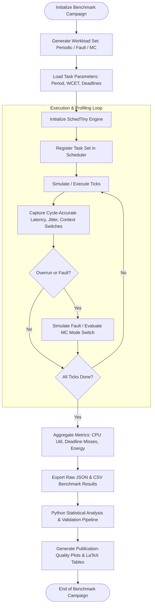

# SchedTiny Benchmark Engine Flow

```mermaid
flowchart TD
    Start([Initialize Benchmark Campaign]) --> WorkloadGen[Generate Workload Set: Periodic / Fault / MC]
    WorkloadGen --> LoadConfig[Load Task Parameters: Period, WCET, Deadlines]
    
    subgraph Execution_Loop["Execution & Profiling Loop"]
        InitSched[Initialize SchedTiny Engine] --> RegTasks[Register Task Set in Scheduler]
        RegTasks --> RunTicks[Simulate / Execute Ticks]
        RunTicks --> MeasureDWT[Capture Cycle-Accurate Latency, Jitter, Context Switches]
        MeasureDWT --> ModeCheck{Overrun or Fault?}
        ModeCheck -- Yes --> InjectFault[Simulate Fault / Evaluate MC Mode Switch]
        ModeCheck -- No --> CheckCompletion{All Ticks Done?}
        InjectFault --> CheckCompletion
        CheckCompletion -- No --> RunTicks
    end
    
    LoadConfig --> InitSched
    CheckCompletion -- Yes --> ExportStats[Aggregate Metrics: CPU Util, Deadline Misses, Energy]
    ExportStats --> JSONExport[Export Raw JSON & CSV Benchmark Results]
    JSONExport --> Analysis[Python Statistical Analysis & Validation Pipeline]
    Analysis --> Figures[Generate Publication-Quality Plots & LaTeX Tables]
    Figures --> End([End of Benchmark Campaign])
```
