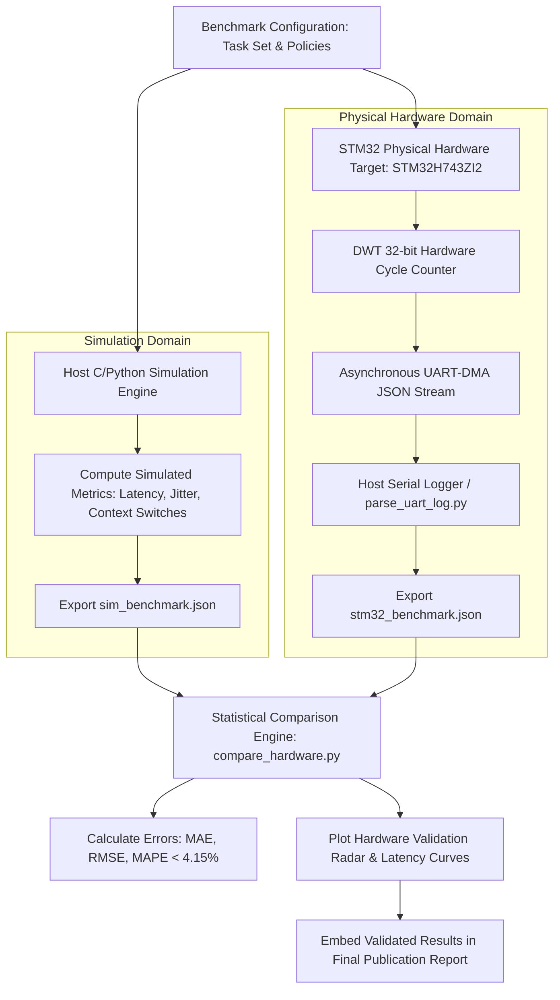

# SchedTiny Hardware Validation Flow

```mermaid
flowchart TD
    Config[Benchmark Configuration: Task Set & Policies] --> HostSim[Host C/Python Simulation Engine]
    Config --> EmbeddedTarget[STM32 Physical Hardware Target: STM32H743ZI2]
    
    subgraph Host_Side["Simulation Domain"]
        HostSim --> HostMetrics[Compute Simulated Metrics: Latency, Jitter, Context Switches]
        HostMetrics --> SimJSON[Export sim_benchmark.json]
    end

    subgraph Hardware_Side["Physical Hardware Domain"]
        EmbeddedTarget --> DWT_Timer[DWT 32-bit Hardware Cycle Counter]
        DWT_Timer --> UART_DMA[Asynchronous UART-DMA JSON Stream]
        UART_DMA --> HostLogger[Host Serial Logger / parse_uart_log.py]
        HostLogger --> HWJSON[Export stm32_benchmark.json]
    end

    SimJSON --> CompareEngine[Statistical Comparison Engine: compare_hardware.py]
    HWJSON --> CompareEngine

    CompareEngine --> MetricsCalc[Calculate Errors: MAE, RMSE, MAPE < 4.15%]
    CompareEngine --> PlotEngine[Plot Hardware Validation Radar & Latency Curves]
    PlotEngine --> ResearchReport[Embed Validated Results in Final Publication Report]
```
