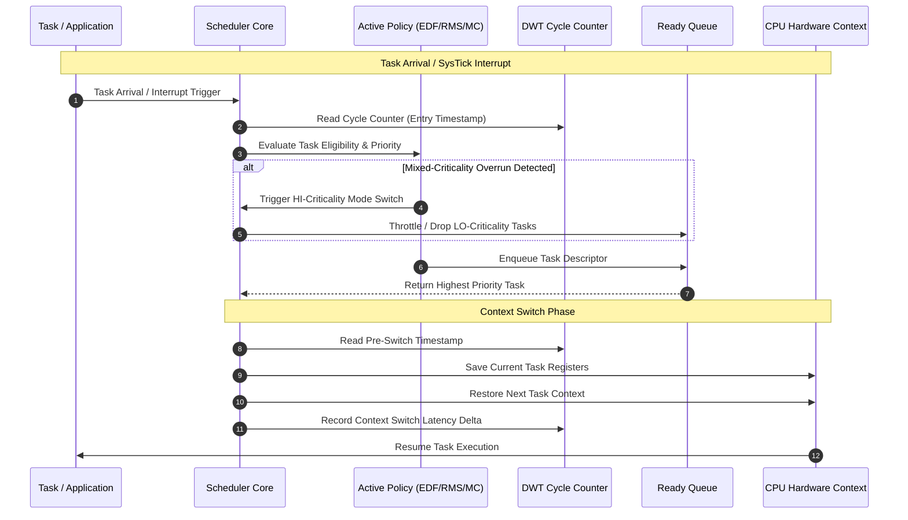

# SchedTiny Scheduler Execution Flow

```mermaid
sequenceDiagram
    autonumber
    participant Task as Task / Application
    participant Core as Scheduler Core
    participant Policy as Active Policy (EDF/RMS/MC)
    participant DWT as DWT Cycle Counter
    participant Queue as Ready Queue
    participant Target as CPU Hardware Context

    Note over Task,Target: Task Arrival / SysTick Interrupt
    Task->>Core: Task Arrival / Interrupt Trigger
    Core->>DWT: Read Cycle Counter (Entry Timestamp)
    Core->>Policy: Evaluate Task Eligibility & Priority
    
    alt Mixed-Criticality Overrun Detected
        Policy->>Core: Trigger HI-Criticality Mode Switch
        Core->>Queue: Throttle / Drop LO-Criticality Tasks
    end

    Policy->>Queue: Enqueue Task Descriptor
    Queue-->>Core: Return Highest Priority Task
    
    Note over Core,Target: Context Switch Phase
    Core->>DWT: Read Pre-Switch Timestamp
    Core->>Target: Save Current Task Registers
    Core->>Target: Restore Next Task Context
    Core->>DWT: Record Context Switch Latency Delta
    
    Target->>Task: Resume Task Execution
```
