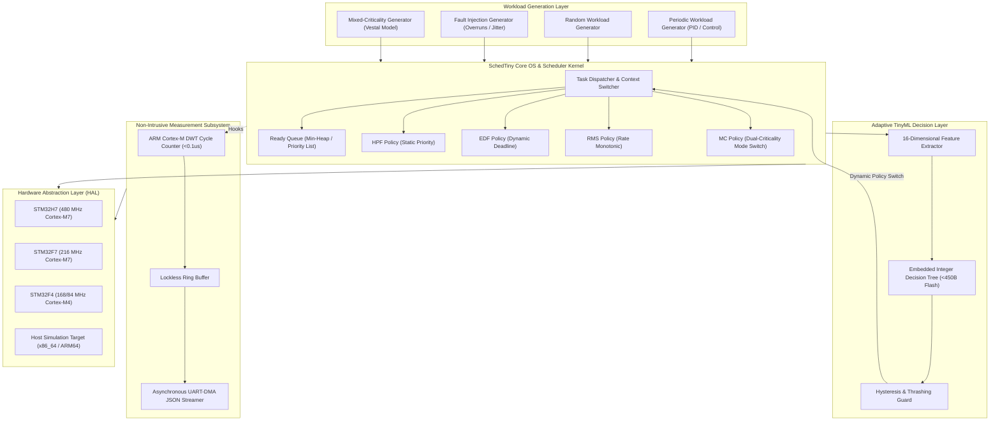

# SchedTiny System Architecture

```mermaid
graph TB
    subgraph Workload_Layer["Workload Generation Layer"]
        PWG["Periodic Workload Generator (PID / Control)"]
        RWG["Random Workload Generator"]
        FIG["Fault Injection Generator (Overruns / Jitter)"]
        MCG["Mixed-Criticality Generator (Vestal Model)"]
    end

    subgraph Decision_Layer["Adaptive TinyML Decision Layer"]
        FE["16-Dimensional Feature Extractor"]
        DT["Embedded Integer Decision Tree (<450B Flash)"]
        HY["Hysteresis & Thrashing Guard"]
    end

    subgraph Core_OS["SchedTiny Core OS & Scheduler Kernel"]
        DISP["Task Dispatcher & Context Switcher"]
        RQ["Ready Queue (Min-Heap / Priority List)"]
        HPF["HPF Policy (Static Priority)"]
        EDF["EDF Policy (Dynamic Deadline)"]
        RMS["RMS Policy (Rate Monotonic)"]
        MC["MC Policy (Dual-Criticality Mode Switch)"]
    end

    subgraph Measurement_Subsystem["Non-Intrusive Measurement Subsystem"]
        DWT["ARM Cortex-M DWT Cycle Counter (<0.1us)"]
        RB["Lockless Ring Buffer"]
        LOG["Asynchronous UART-DMA JSON Streamer"]
    end

    subgraph Hardware_Layer["Hardware Abstraction Layer (HAL)"]
        H7["STM32H7 (480 MHz Cortex-M7)"]
        F7["STM32F7 (216 MHz Cortex-M7)"]
        F4["STM32F4 (168/84 MHz Cortex-M4)"]
        SIM["Host Simulation Target (x86_64 / ARM64)"]
    end

    PWG --> Core_OS
    RWG --> Core_OS
    FIG --> Core_OS
    MCG --> Core_OS

    Core_OS --> FE
    FE --> DT
    DT --> HY
    HY -->|Dynamic Policy Switch| DISP

    DISP --> HPF
    DISP --> EDF
    DISP --> RMS
    DISP --> MC
    DISP --> RQ

    Core_OS -.->|Hooks| DWT
    DWT --> RB
    RB --> LOG

    Core_OS --> Hardware_Layer
    Measurement_Subsystem --> Hardware_Layer
```
