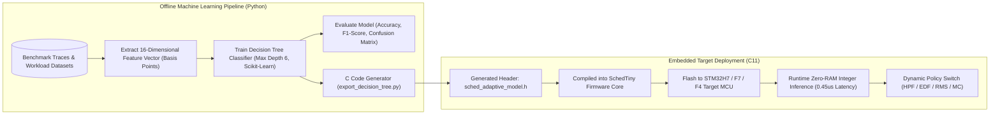

# SchedTiny TinyML Pipeline Flow

```mermaid
flowchart LR
    subgraph Offline_Pipeline["Offline Machine Learning Pipeline (Python)"]
        RawData[(Benchmark Traces & Workload Datasets)] --> FeatureEng["Extract 16-Dimensional Feature Vector (Basis Points)"]
        FeatureEng --> TrainModel["Train Decision Tree Classifier (Max Depth 6, Scikit-Learn)"]
        TrainModel --> Evaluate["Evaluate Model (Accuracy, F1-Score, Confusion Matrix)"]
        TrainModel --> CodeGen["C Code Generator (export_decision_tree.py)"]
    end

    subgraph Embedded_Deployment["Embedded Target Deployment (C11)"]
        CodeGen --> Header["Generated Header: sched_adaptive_model.h"]
        Header --> CoreSched["Compiled into SchedTiny Firmware Core"]
        CoreSched --> TargetMCU["Flash to STM32H7 / F7 / F4 Target MCU"]
        TargetMCU --> RuntimeInference["Runtime Zero-RAM Integer Inference (0.45us Latency)"]
        RuntimeInference --> DynamicAdapt["Dynamic Policy Switch (HPF / EDF / RMS / MC)"]
    end
```
